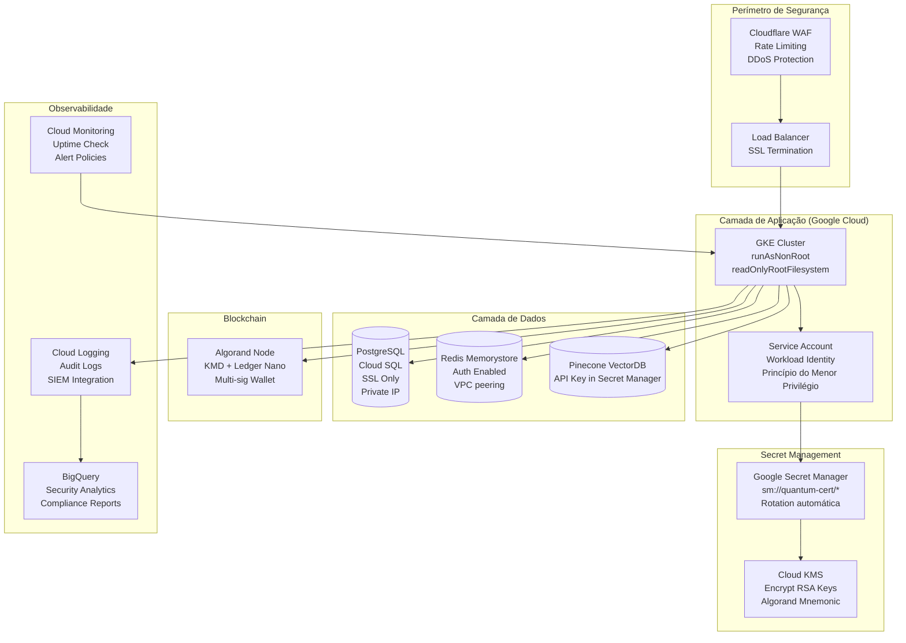

# Security Policy

## Supported Versions

| Version | Supported          |
| ------- | ------------------ |
| 1.0.x   | :white_check_mark: |
| < 1.0   | :x:                |

*   **Database**: Parameterized queries via Prisma (No SQL Injection).
*   **Infrastructure**:
    *   Non-root Docker containers.
    *   Read-only root filesystems where possible.
    *   Secrets management via Google Secret Manager (`sm://` notation).
*   **Network**: Strict CORS whitelist.
*   **Logging**: Audit logs for all sensitive actions (BigQuery).

## Audit History

*   **2025-12-02**: Critical Security Audit & Remediation (Fixes: execSync, SQLi, JWT, Docker).

## 4. Security Architecture

